# Technical Documentation of the MVP – Trivia Game "Beast Quiz" (Version 1.1.0)

## System description

**By:**

* Sofía Nuñez
* Martín Suarez
* Ignacio Cabrera
* Emanuel Romero

## Introduction

This document describes the technical design of the MVP (Minimum Viable Product) of a trivia game developed with Flutter and Firebase. Its objective is to clearly define how the system is intended, which features it includes, how it is organized internally and why certain decisions were made.

The documentation serves as a guide for the development team, allowing them to understand the system structure before coding and reducing errors during implementation.

---

## MVP Goal

The system's goal is to offer an interactive, scalable, and easy-to-maintain trivia game that allows users to answer questions, record scores, and improve their experience through an intuitive interface.

Additionally, this system seeks to offer an interactive and structured way of learning through a question game, combining progress and motivation mechanics.

We chose the following key features:

* Secure user authentication (Google Sign-In).
* Node map with simple progression.
* Questions organized by topic.
* Points and lives system.
* Anti-repeat question system.
* Progress persistence in the cloud (Firestore).

# System requirements

Defining requirements allows understanding what the system must do before describing its architecture, ensuring better organization of the design.

### Functional requirements:

The system must allow:

- Start a trivia game.
- Show questions with multiple answer options.
- Record the answer selected by the player.
- Calculate the player's score.
- Show results at the end of the game.
- Store questions and answers in the database.
- Manage game logic through the game engine.

### Non-functional requirements

The system must meet the following criteria:

- **Usability:** the interface must be simple and intuitive for the user.
- **Performance:** fast responses from the system. In less than two seconds.
- **Scalability:** possibility to add more questions and features without affecting operation.
- **Maintainability:** modular code that facilitates future modifications.
- **Portability:** the application must be able to run on different mobile devices thanks to the use of Flutter.

### Scope justification

We decided to limit the scope of the MVP to:

* **Validate the basic flow (Auth + Gameplay):** Ensure that a user can log in, play and that their progress is saved correctly before adding social mechanics.
* **Reduce initial technical complexity:** Avoid overloading development with advanced features such as stores or global online rankings.
* **Facilitate scalability:** Leave the architecture (Clean Architecture) prepared so that new features can be added as "Use Cases" without breaking existing code.

### Features outside the MVP

* Global online ranking.
* AI-generated questions.
* Advanced cosmetic store.
* Social system (creation of question packs by users).

**Justification:**
Separating the scope allows focusing on the core of the game and avoiding overloading development with features that are not essential to validate the main mechanic and the stability of data persistence.

---

## Game concept and Flow

**Start (Auth) -> Node map -> Select node -> Question -> correct/incorrect -> evaluate lives/progress -> Map**

### Game states (FSM)

The flow is controlled by a Finite State Machine (FSM) with the following states defined in `GameState`:
`idle` → `loading` → `navigating` → `playing` → `gameOver` / `nodeCompleted`

**Rationale of the concept and game state:**
The design of this flow is based on three principles:

1. **Cognitive simplicity:** The player quickly understands what to do: log in, choose a node, answer.
2. **Immediate and Persistent Feedback:** The player instantly knows whether they were correct, and knows that their progress is safe in the cloud thanks to their account.
3. **Strict UI control:** We use a formal state model (FSM) managed by the `GameEngine` because:
* It avoids visual inconsistencies (e.g., the user tapping "play" twice while loading).
* It facilitates routing through the `GameOrchestrator`, which simply "reacts" to the current state.
* It reduces classic Flutter navigation errors (`Navigator.push` nested).

---

## MVP Rules

**Nodes and Topics:**

* 30 nodes in total (1 topic per node, 3 questions per node).
* Popular topics (Movies, Video Games, General Knowledge).
* **Justification:** Offers enough content to generate a sense of progress without exhausting the question database prematurely.

**Advancement Mechanic and Lives:**

* The player starts with **3 lives** persisted in their profile.
* Correct answer → +10 points, progresses in the node.
* Incorrect answer → Loses 1 life, new question.
* Lives at 0 → `gameOver` state, the active session is cleared, returns to the menu.
* **Justification:** Implementing lives and scores anchored to the authenticated user's profile raises the "risk/reward" level, increasing retention compared to a system without penalties.

**Anti-repeat system:**

* Questions shown are saved in the current `GameSession`.
* **Justification:** Improves the experience by avoiding repetitive content. By linking the session to the `userId`, the player can close the app, reopen it and the system will know exactly which questions they already saw in that attempt.

---

## User Stories (MoSCoW)

### Must Have (mandatory)

* **As a player**, I want to sign in with my Google account so my progress is securely saved in the cloud.
* **As a system**, I want to create an automatic profile for new players to avoid manual registration flows.
* **As a player**, I want to see a map with nodes to choose levels and understand my progress.
* **As a player**, I want immediate feedback on my answers.

### Should Have (important)

* As a player, I want to obtain rewards (coins/points) when completing nodes to feel motivated.
* As a system, I want to clean up abandoned game sessions to optimize the database.

### Won't Have (out of MVP)

* As a player, I want to customize my character with store items.
* As a player, I want to recover lives by watching ads.

**Justification:**
Prioritization aligns technical efforts with actual value provided to the user. Including authentication in the *Must Have* is vital, since without it, cloud persistence loses meaning because you cannot identify who the data belongs to.

---

## System Architecture

### Overview and Evolution

The project started with an MVC vision, but **evolved to Clean Architecture**. It is divided into three strict layers:

1. **Presentation Layer (UI):** Widgets, Screens (`Home`, `MapScreen`) and the `GameOrchestrator`.
2. **Domain Layer (Rules):** Entities (`Player`, `Node`), Use Cases (`LoginUseCase`, `StartNodeUseCase`) and the `GameEngine` (state manager).
3. **Data Layer (Infrastructure):** Repositories (`AuthRepository`, `PlayerRepository`) and the connection to Firebase.

### The Authentication Module (New in v1.2.0)

Google Sign-In was integrated respecting the architecture:

* `AuthRepository` (Data): Talks to Google and FirebaseAuth SDKs. Creates the user document in Firestore if new.
* `LoginUseCase` (Domain): Called by the UI. Executes validation and returns credentials.
* `Home` (Presentation): Shows the `CircularProgressIndicator` (`_isLoading`) while waiting for the result, and then injects the `Player` into the `GameEngine`.

### Architectural Rationale (From MVC to Clean Architecture)

The MVC pattern was abandoned because, as the game grew (adding sessions, lives, and external authentication), controllers centralized too much logic and became hard to maintain.

**Benefits of the current architecture:**

* **Total decoupling:** The `Home` screen does not know we use Google or Firebase; it only knows it calls `LoginUseCase` and receives a player. If tomorrow we change Google to Apple Sign-In, the UI is untouched.
* **Testability:** Each use case (e.g., `LoseLifeUseCase`) can be unit tested in isolation.
* **Single Source of Truth:** The `GameEngine` maintains an immutable state (`GameEngineState`). The whole app reacts to this single data flow, eliminating desynchronization bugs.

---

### Diagrams for our MVP

Using UML and flow diagrams allows us to represent the system from different perspectives: structural, dynamic and behavioral. Each diagram plays a specific role to validate our design decisions before and during implementation.

# 1. Layered Architecture Diagram

Shows the high-level separation of the system into three main layers (Presentation, Domain, Data) and their connection to external services (Firebase / Google Auth).
It is the fundamental map of our Clean Architecture. We include it to show that the "Dependency Rule" is respected: the graphical interface (UI) never accesses the database (Data/External) directly, guaranteeing a modular and easily testable system.

Fragment of code
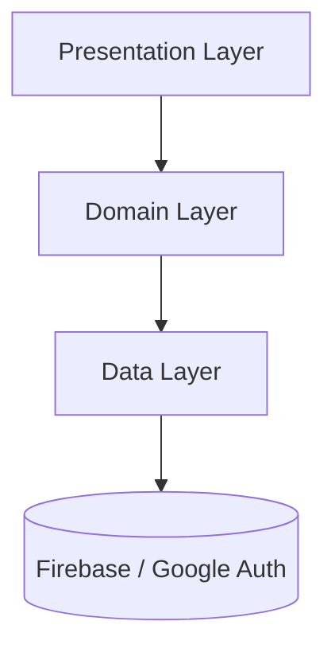

# 2. Component Diagram – Presentation Layer
Details how the graphical interface is structured, showing the GameOrchestrator as the central node that routes to the different screens (HomeScreen, MapScreen, TriviaScreen).
We include it to explain to any frontend developer that navigation in our game is not imperative (we don't do Navigator.push directly in game buttons), but reactive. The orchestrator "reacts" to the engine state and draws the corresponding screen.

Fragment of code
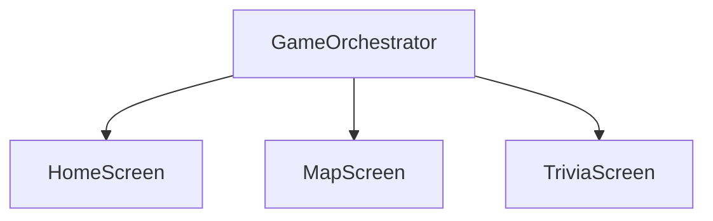

# 3. Component Diagram – Domain Layer
Visualizes the game's logical core. Shows how the GameEngine orchestrates the different Use Cases instead of executing logic itself.
This diagram justifies the use of the Single Responsibility Principle (SRP). Instead of having a "God Object" (a giant brittle game engine), we divide actions into isolated use cases. This allows changing how life is lost (LoseLifeUseCase) without affecting how answers are validated (AnswerQuestionUseCase).

Fragment of code
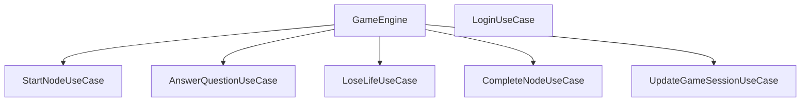

# 4. Domain Class Diagram
Represents the main game entities (Player, Node, Question, GameSession) and how they relate conceptually to each other.
We put it to establish the project's "ubiquitous vocabulary". It is vital to understand the intentional separation between Player and GameSession. The Player stores permanent data (identity, lives, global points), while the GameSession stores volatile data (the current attempt, shown questions). This allows recovering interrupted games without "polluting" the player's profile.

Fragment of code
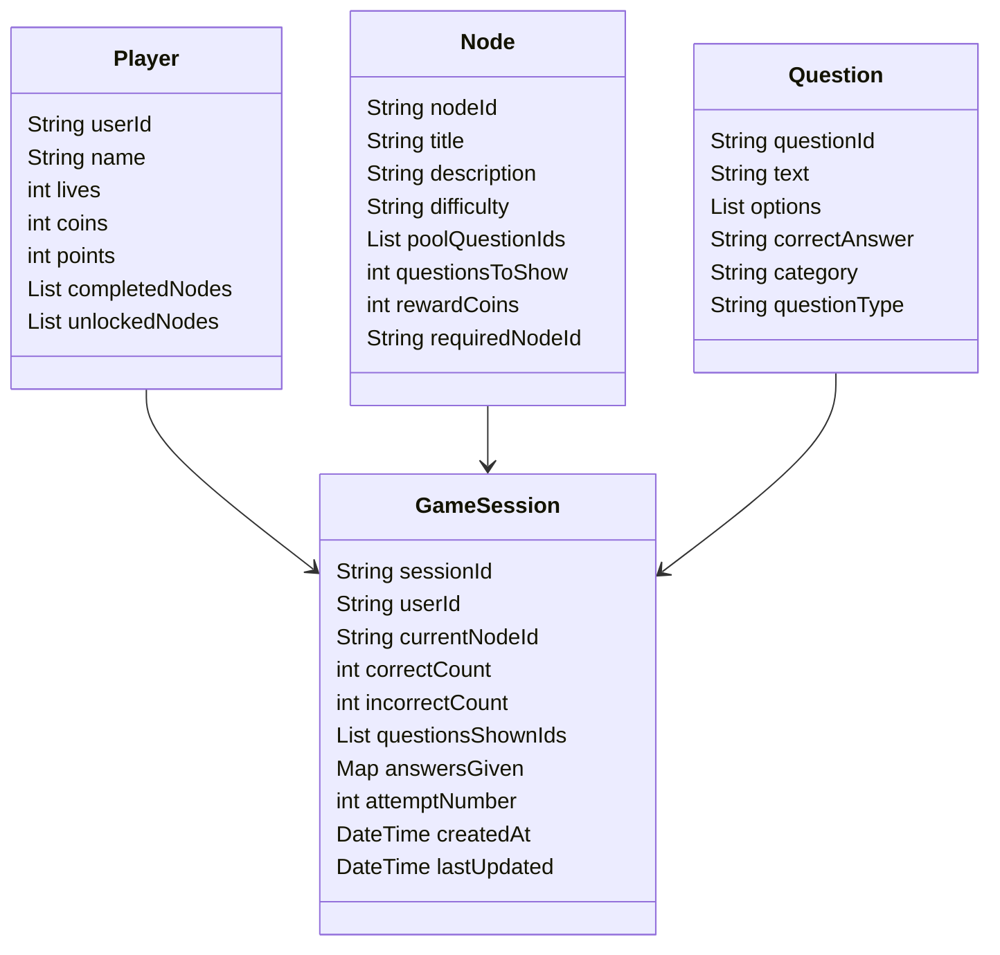

# 5. State Diagram (GameEngine FSM)
Models the game's behavior as a Finite State Machine (FSM), showing all possible GameState states and the actions that cause transitions between them.
It was included to remove ambiguity in the application's flow. By formalizing states, we avoid critical bugs (for example, the user trying to answer a question while the state is loading). It makes the system predictable and mathematically testable.

Fragment of code
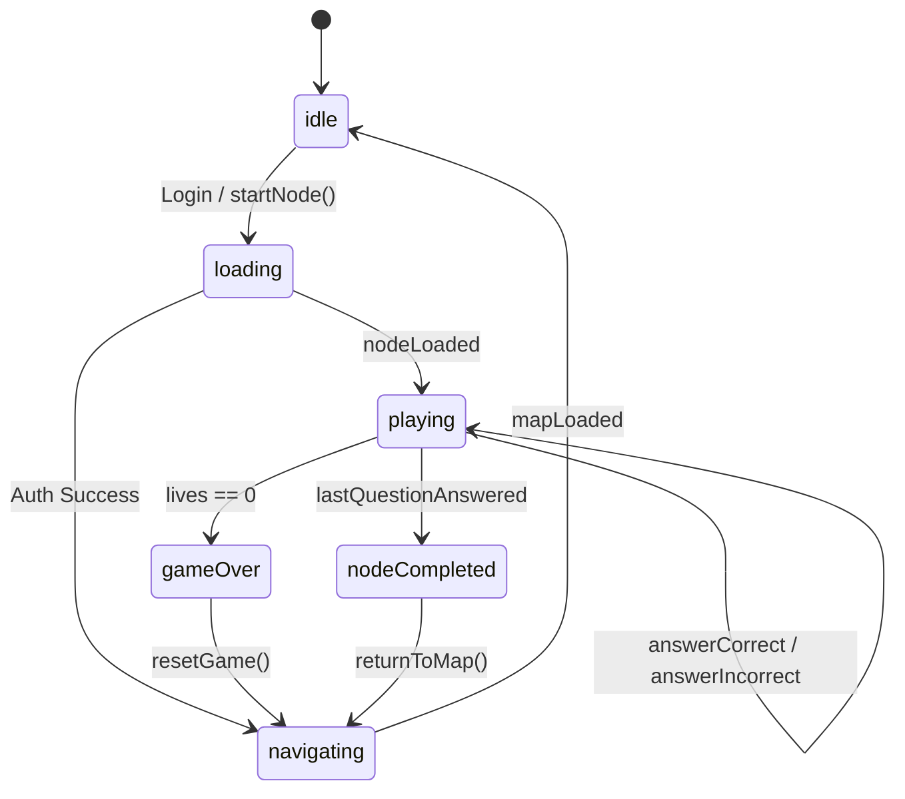

# 6. Sequence Diagram – Authentication Flow (Login)
Describes the chronological step-by-step from the user tapping the "PLAY" button until the game engine receives the authenticated player and sends them to the map.
Login is a critical asynchronous process that involves multiple layers (UI, Domain, Data) and external services (Google). This diagram was included to ensure the team understands that the "loading" state and the database lookup must resolve before injecting the Player into the engine.

Fragment of code
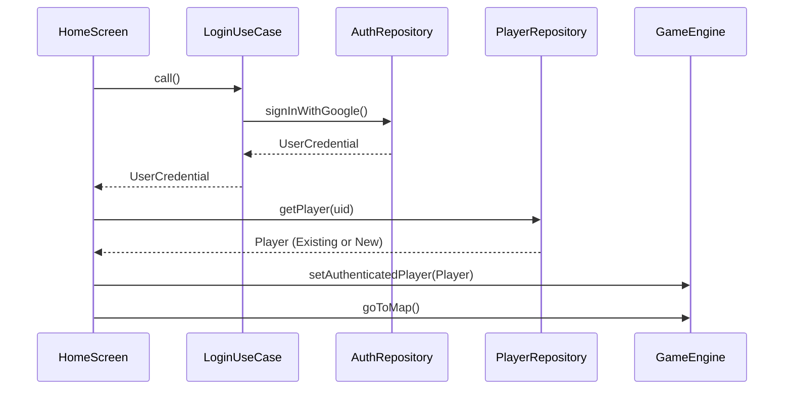

# 7. Sequence Diagram – Start Node
Explains how the system loads a specific level, coordinating fetching the node, randomly selecting questions and creating the session in the database.
It demonstrates the complexity that StartNodeUseCase abstracts from the GameEngine. It justifies the existence of this use case, since it must orchestrate three different repositories (NodeRepository, QuestionRepository, GameSessionRepository) to prepare the game scene asynchronously.

Fragment of code
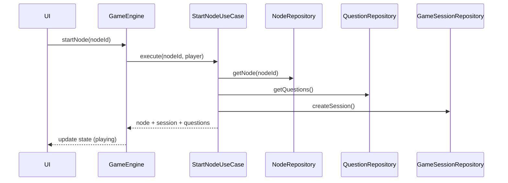

# 8. Sequence Diagram – Answer Question
Shows the interaction when the user chooses an option: validation of the answer, updating the session in the cloud, possible life loss and emission of the new state.
Represents the trivia core loop. We included it to justify the separation of evaluation logic (AnswerQuestionUseCase) from punishment logic (LoseLifeUseCase). Also shows that persistence occurs at every step, avoiding loss of progress if the app closes unexpectedly.

Fragment of code
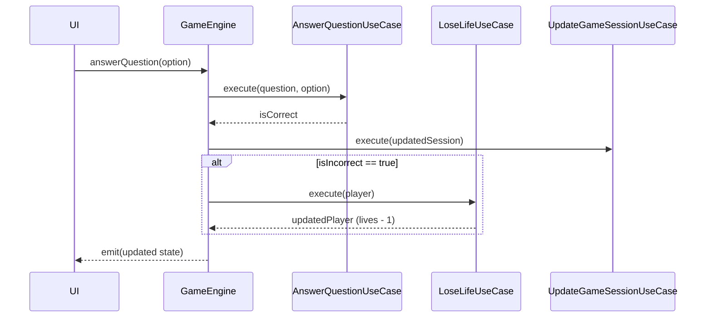

# 9. Sequence Diagram – Complete Node
Shows what happens when answering the last question of a level: calculation of points and coins, updating the profile in Firestore and cleaning the active session.
It evidences how volatile progress is consolidated into permanent progress. It was included to justify why the GameSession is deleted (GameSessionRepository: delete session); this is an architectural decision to avoid the database filling with "garbage sessions" once the level was successfully completed.

Fragment of code
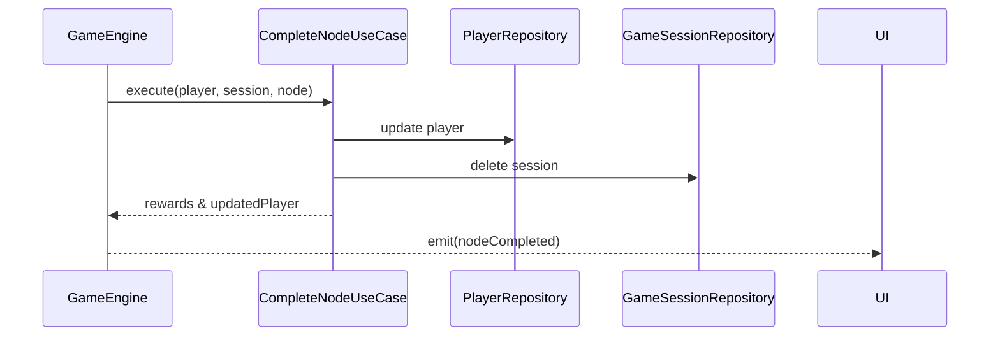

# 10. Internal Diagram of GameEngineState
Details the exact structure of the immutable state object that the GameEngine constantly emits to the UI.
In a reactive architecture, the state is the only source of truth for the view. This diagram justifies what information the UI has available at any given time, showing that the interface doesn't need to compute anything, just read properties like currentQuestionIndex or isLoading.

Fragment of code
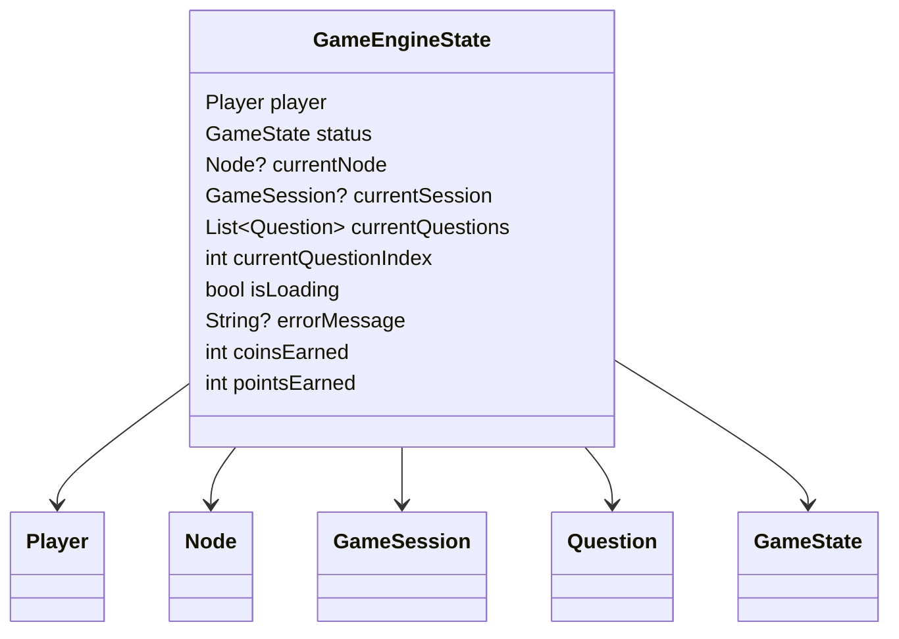
# 11. Dependency Diagram between Use Cases
Clearly maps which use cases interact with which repositories, and how the engine consumes them.
Serves as a Dependency Injection (DI) map. We included it to justify why certain use cases (like AnswerQuestionUseCase or LoseLifeUseCase) are classified as "Pure logic" (Pure logic) that do not touch repositories; this makes them ultra-fast and simplifies writing unit tests without needing to "mock" databases.

Fragment of code
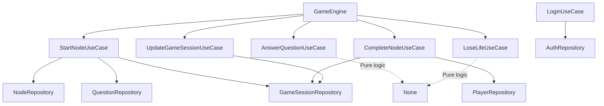

# 12. Complete Diagram – Integrated Clean Architecture
Is the "big picture" of the system. It joins the Interface, Domain, Data and external dependencies in a single hierarchical flow.
It justifies the robustness of the architecture by visually showing that the UI and the Database are at opposite ends of the spectrum, communicating cleanly and unidirectionally through the logical center (Domain).

Fragment of code
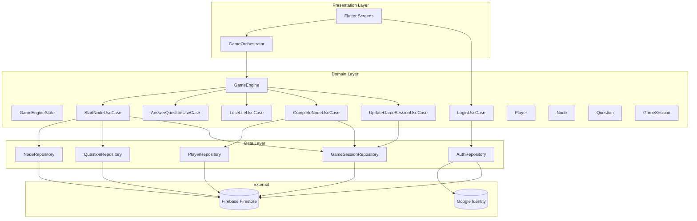

# 13. Database Design (Firestore ER Diagram)
Defines the structure of the NoSQL collections (Users, nodes, questions, game_sessions), their properties and how they are logically related via their identifiers (IDs).
It is essential to understand how data is organized in the cloud to maximize performance. Separating into individual collections avoids using "giant nested documents", optimizing Firestore read costs. Also justifies using the Google Auth UID as primary key (PK) in the USERS collection, allowing ultra-fast direct reads at login.

Fragment of code
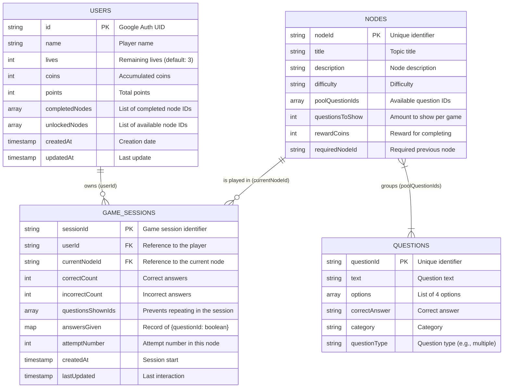
---

## Specification of Internal Operations (Use Cases)

Instead of traditional API endpoints, our mobile system uses **Use Cases** interacting with Firestore:

* `LoginUseCase`: Authenticates and ensures profile creation.
* `StartNodeUseCase`: Gets the node, extracts the questions and creates the session.
* `AnswerQuestionUseCase`: Checks the correctness of the chosen option.
* `UpdateGameSessionUseCase`: Sends the updated counters to the cloud.

**Justification:**
Encapsulating these operations in Use Cases is equivalent to having "internal endpoints". If tomorrow the game migrates from Firestore to a custom backend (e.g., Node.js or Python), **only the repositories will be modified**; the use cases and the interface will keep working intact.

---

## Rationale for chosen technologies

### 1) Flutter

We chose Flutter because it allows us to develop for iOS and Android from a single codebase, prioritizing reactive UIs and smooth animations over heavy graphics engines (Godot/Unity) that are not needed for a 2D trivia.

### 2) Firebase (Auth + Firestore)

For an MVP, standing up a custom backend (with JWT, servers, SQL databases and protection against attacks) would delay the project by months.
**Justification:** - **Firebase Auth** solves security, token management and native integration with Google Sign-In in a free and scalable way.

* **Firestore** gives us real-time persistence, vital to save the `GameSession` state after each question without perceivable latency.

---

## Quality Strategy (QA)

**Unit Tests:**

* Validate that `LoseLifeUseCase` correctly decrements and triggers "Game Over" when appropriate.
* Mock `AuthRepository` to ensure `LoginUseCase` handles login rejections without crashing the app.

**Integration Tests:**

* Ensure that when completing a node (`CompleteNodeUseCase`), the `PlayerRepository` is updated in the cloud and the `GameSessionRepository` deletes the active session.

**Manual Tests:**

* Force connection loss during login or when answering a question to validate UI robustness.

**Justification:**
In a system with remote persistence, the biggest risk is loss of synchronization. Focusing QA on state transitions and save validation ensures the player doesn't feel the game "steals" progress or lives.

---

## Project Risks and Limitations

* **Dependence on Google Identity:** If Google service fails or the user does not have an account, they cannot play. (Future mitigation: Add "Guest Login").
* **Firestore read/write costs:** In MVP stage reads are manageable, but saving the `GameSession` after every answered question generates many writes. If the game scales massively, this logic must be optimized (e.g., caching locally and syncing only at node completion).
* **Handling asynchronous states:** Transition between the Login screen and the Map requires user data to download correctly. Slow networks can create bottlenecks on the loading screen.

---

## Conclusion

The "Beast Quiz" MVP has transcended the academic prototype state to become an application with a professional architecture.

Adopting Clean Architecture, together with a strict FSM (State Machine) and the full integration of **Cloud Authentication**, makes the game not only functional but secure and ready to scale. The technical decisions protect the code from the "spaghetti effect", ensuring future mechanics (stores, multiplayer, tournaments) can be integrated on a solid and well-structured foundation.

---